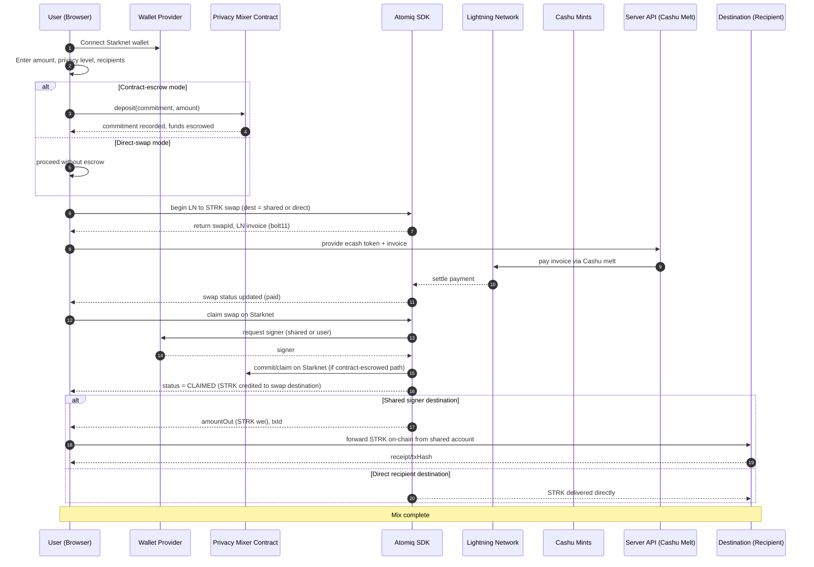
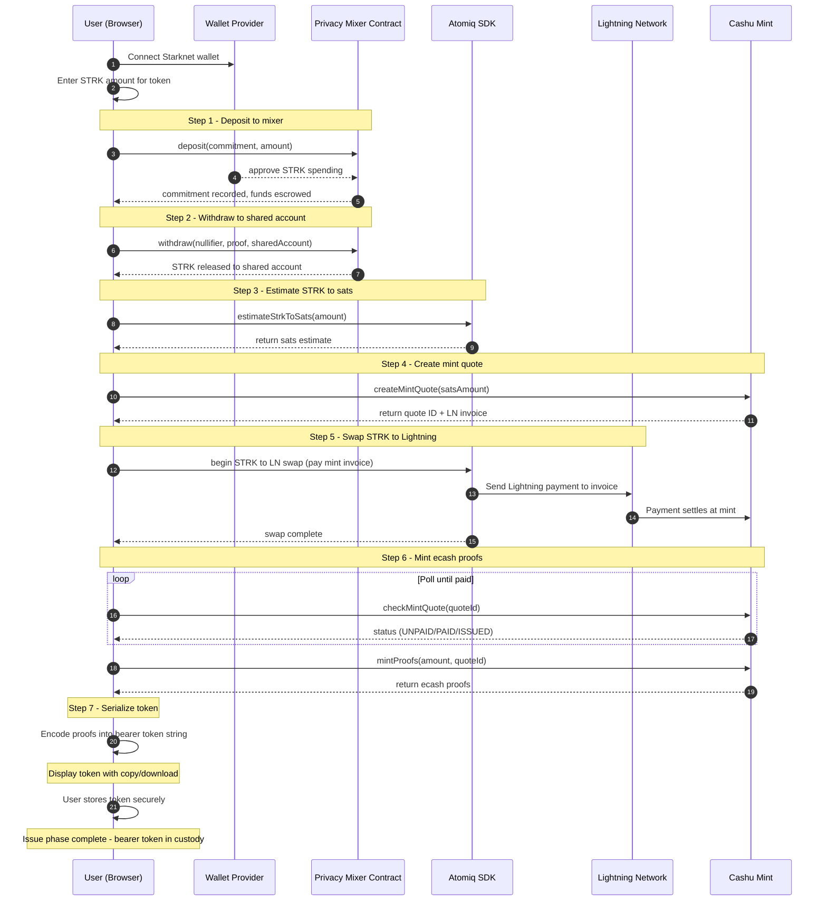
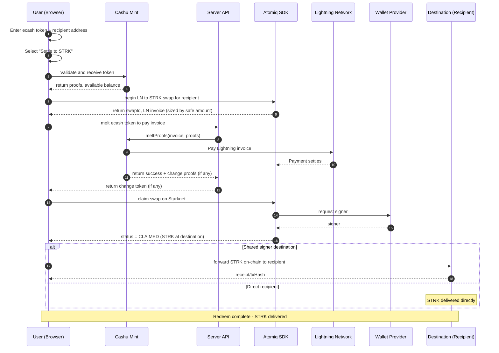
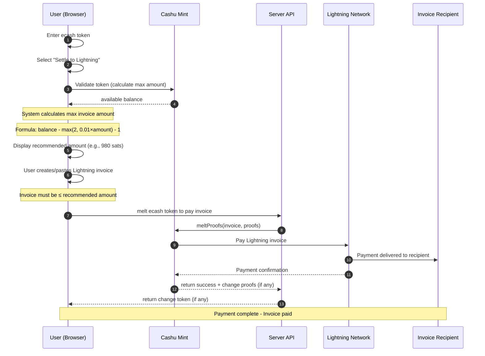
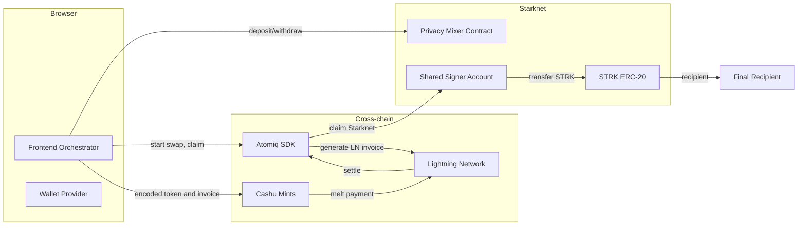
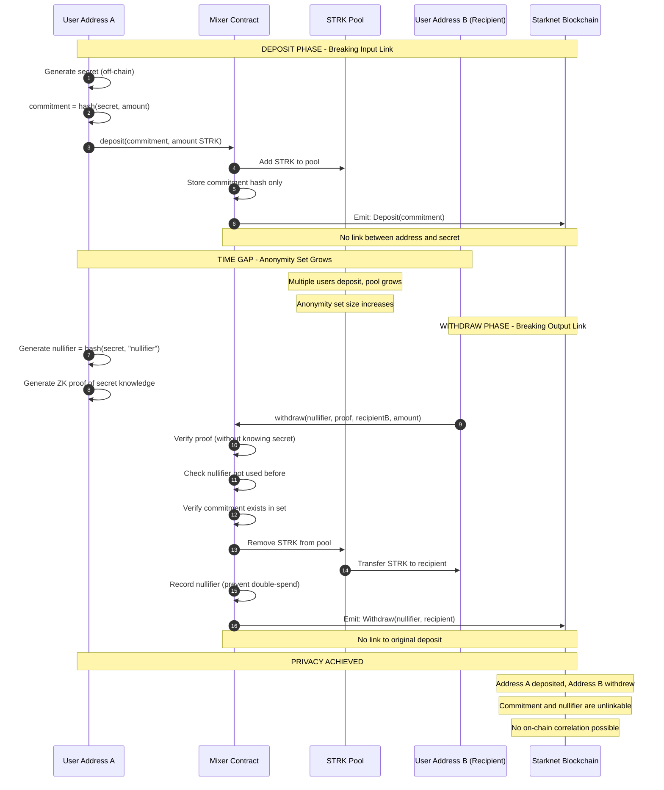

# SLPM - Starknet Lightning Privacy Mixer

## What is SLPM?

SLPM (Starknet Lightning Privacy Mixer) is a decentralized privacy solution that breaks on-chain transaction linkability on Starknet by routing funds through multiple privacy-preserving layers. It combines the power of zero-knowledge cryptography, cross-chain Lightning Network routing, and Cashu ecash to provide strong privacy guarantees for STRK token transfers.

### The Privacy Problem

Traditional blockchain transactions are permanently recorded on public ledgers, creating an immutable trail of financial activity. Every transaction reveals:
- **Who sent funds** (sender address)
- **Who received funds** (recipient address)  
- **How much was transferred** (exact amount)
- **When it happened** (timestamp)
- **Transaction relationships** (linked through addresses)

This transparency makes it trivial to track fund flows, analyze spending patterns, and build comprehensive financial profiles of users. Even using different addresses doesn't help—sophisticated chain analysis can often link addresses through transaction patterns, timing, and amounts.

### The SLPM Solution

SLPM solves this by breaking the on-chain linkability through a multi-layer privacy architecture:

1. **Privacy Mixer Contract** (Starknet Layer)
   - Uses cryptographic commitments and zero-knowledge proofs
   - Deposits go in from Address A, withdrawals come out to Address B
   - No on-chain link between deposit and withdrawal addresses
   - Anonymity set grows with every participant

2. **Cross-Chain Privacy Hop** (Lightning Network)
   - Routes funds off-chain through Bitcoin Lightning Network
   - Breaks Starknet transaction graph completely
   - Lightning payments are instant and untraceable
   - No permanent record on either blockchain

3. **Bearer Token Privacy** (Cashu Ecash)
   - Converts funds into anonymous bearer tokens
   - Tokens can be held offline, transferred peer-to-peer
   - No ledger tracking token transfers
   - Ultimate financial privacy and sovereignty

### Key Benefits

#### **Privacy Protection**
- **On-chain unlinkability**: Impossible to connect sender and recipient addresses
- **Amount obfuscation**: Exact amounts hidden through mixing and splitting
- **Timing decorrelation**: Variable delays prevent timing analysis
- **Graph analysis resistance**: Transaction graph breaks at multiple points

#### **Financial Sovereignty**
- **Self-custody options**: Control your own bearer tokens (Split Mix)
- **No KYC required**: Fully permissionless and anonymous
- **Censorship resistant**: No central party can block transactions
- **Peer-to-peer transfers**: Bearer tokens can be gifted or traded offline

#### **Cross-Chain Flexibility**
- **Lightning integration**: Instant, low-fee Bitcoin network routing
- **Starknet security**: Benefits from L2 scalability and low costs
- **Interoperable**: Bridges multiple ecosystems seamlessly
- **Future-proof**: Architecture supports additional chains

#### **User-Friendly Design**
- **Two modes available**: Choose Full Mix (automated) or Split Mix (manual custody)
- **Flexible amounts**: Mix any amount of STRK tokens
- **Multiple recipients**: Distribute to several addresses simultaneously
- **Simple interface**: Complex cryptography hidden behind clean UX

### Real-World Use Cases

**Personal Privacy**
- Salary payments without employer tracking spending
- Donations to causes without public disclosure
- Purchases without vendor profiling
- Savings accumulation without surveillance

**Business Applications**
- Confidential supplier payments
- Anonymous payroll for sensitive operations
- Private treasury management
- Competitive intelligence protection

**Emergency Scenarios**
- Asset protection during political instability
- Financial escape routes from oppressive regimes
- Wealth preservation during crackdowns
- Anonymous aid distribution

### How It Works (Simple Overview)

**Full Mix Mode** (Automated - 1 minute):
```
Your Address → [Privacy Mixer] → [Lightning] → [Cashu] → [Lightning] → Recipient Address
     ↓              ↓                ↓            ↓           ↓              ↓
  Deposit      Commitment        Off-chain    Anonymous   Off-chain      Receive
               + Proof           Payment       Token       Payment        Clean STRK
```

**Split Mix Mode** (Manual Custody - Hours to Years):
```
Phase 1 (Issue Token):
Your Address → [Privacy Mixer] → [Lightning] → [Cashu Mint] → Your Custody
     ↓              ↓                ↓              ↓              ↓
  Deposit      Commitment        Off-chain      Mint Token    Store Securely
               + Proof           Payment                       (offline/encrypted)

[Time Gap: Hours, Days, Months, or Years]

Phase 2 (Redeem Token):
Your Token → [Cashu Mint] → [Lightning] → [Atomiq] → Recipient Address
     ↓            ↓             ↓             ↓            ↓
  Provide     Melt Token    Off-chain      Claim on      Receive
  Token       to Lightning   Payment       Starknet      Clean STRK
```

### Privacy Strength

SLPM provides **military-grade financial privacy** through:
- **Cryptographic guarantees**: Based on collision-resistant hash functions and zero-knowledge proofs
- **Multi-layer obfuscation**: Three independent privacy layers (ZK proofs, Lightning, Cashu)
- **Large anonymity sets**: Your transaction is hidden among hundreds or thousands of others
- **No metadata leakage**: IP addresses, timing patterns, and amounts all protected
- **Forward secrecy**: Even if secrets leak later, past transactions remain private

## Technical Architecture

This section provides detailed technical documentation of the SLPM architecture, component interactions, and execution flows.

### Mixing Modes

SLPM provides two distinct mixing modes, each optimized for different use cases:

### Full Mix (Automated)
Complete privacy pipeline where the system orchestrates all steps automatically:
- User deposits STRK
- System converts STRK → Lightning → Cashu → Lightning → STRK
- Final STRK delivered to recipient address(es)
- User never handles intermediate ecash tokens
- Optimal for users who want a streamlined, automated experience

### Split Mix (Manual Custody)
Two-phase flow with user custody of bearer ecash tokens:

**Phase 1: Issue Token**
- User deposits STRK
- System converts STRK → Lightning → Cashu ecash token
- Token displayed to user with copy/download options
- User stores token securely (offline, encrypted, etc.)
- Flow ends; no automatic redemption

**Phase 2: Redeem Token**
- User provides stored ecash token + recipient address
- System converts Cashu → Lightning → STRK
- STRK delivered to specified recipient
- Any change returned as a new ecash token

**Split Mix Benefits:**
- Enhanced privacy: temporal disconnect between issue and redemption
- User custody: bearer token can be stored offline, transferred peer-to-peer
- Flexibility: redeem at any time, to any recipient
- Emergency backup: token represents value that can be recovered
- Gift/transfer: token can be given to another party

## Components

- Frontend (Next.js): Orchestrates the flow, collects user input (amount, destinations, privacy level), tracks progress, and displays status.
- Wallet Provider (Starknet): Manages user wallet connection and signing for on-chain operations.
- Privacy Mixer Contract (Starknet): Receives deposits, records commitments/nullifiers, and enforces withdrawal rules. Holds funds during the mix lifecycle in designs that route through the contract.
- Atomiq SDK: Cross-chain swap engine for STRK ↔ Bitcoin Lightning. Produces LN invoices and claims swaps on Starknet using a signer.
- Lightning Network: Settlement layer for BTC payments used as a privacy hop.
- Cashu Mint(s): E-cash issuers that convert paid LN invoices into bearer tokens and later melt tokens back to LN payments.
- Server API (optional): Performs server-side Cashu receive-and-melt with retries to remove client instability and wallet prompts.

## High-level Flow

### Full Mix Flow

1. User inputs amount and recipient(s), connects wallet.
2. STRK is moved into the mixing pipeline. Depending on mode, funds are either escrowed in the Privacy Mixer Contract or swapped directly.
3. STRK → LN via Atomiq: Atomiq creates a LN invoice that will be paid using ecash melt; later, the swap is claimed on Starknet by a signer that controls the destination address.
4. LN → Cashu: The LN invoice is paid, minting Cashu tokens. Tokens are shuffled, optionally across multiple mints, split, and time-delayed.
5. Cashu → LN: Cashu tokens are melted into a new LN payment that targets a second Atomiq invoice for STRK.
6. LN → STRK via Atomiq: Atomiq claims the swap using the appropriate Starknet signer and releases STRK to a destination account. If a shared signer is used, STRK is then forwarded on-chain to the final recipient address(es).

### Split Mix Flow

**Issue Token Phase:**

1. User inputs STRK amount, connects wallet.
2. System deposits STRK to Privacy Mixer Contract (with commitment/nullifier).
3. System immediately withdraws from mixer to shared swap account (privacy-preserving).
4. System estimates STRK→sats conversion rate via Atomiq.
5. System creates Cashu mint quote (Lightning invoice for target sats amount).
6. System swaps withdrawn STRK→Lightning via Atomiq, paying the mint invoice.
7. System waits for Lightning payment confirmation at mint.
8. System mints Cashu ecash proofs from mint.
9. System serializes proofs into bearer token string.
10. Token displayed to user with copy/download options.
11. User stores token securely (ends Issue Token phase).

**Redeem Token Phase:**

The user can choose between two settlement options:

**Option 1: Settle to STRK (via Atomiq)**

1. User provides stored ecash token + recipient Starknet address.
2. System validates and decodes token to determine available balance.
3. System calculates safe invoice amount (accounting for mint fees using formula: `max_amount = balance - max(2, 0.01×amount) - 1`).
4. System creates Atomiq LN→STRK swap, generating Lightning invoice.
5. System melts Cashu token to pay Lightning invoice (server-side with retries).
6. System waits for Lightning payment to settle Atomiq swap.
7. System claims STRK from Atomiq on Starknet.
8. If using shared signer, system forwards STRK to final recipient on-chain.
9. Success: STRK delivered to recipient; any change returned as new token.

**Option 2: Settle to Lightning Invoice (Direct Payment)**

1. User provides stored ecash token + Lightning invoice to pay.
2. System validates and decodes token to determine available balance.
3. System displays calculated maximum invoice amount using fee formula: `max_amount = balance - max(2, 0.01×amount) - 1`.
4. User creates Lightning invoice with recommended amount.
5. System melts Cashu token directly to pay the Lightning invoice (server-side).
6. Success: Lightning invoice paid; any change returned as new token.

*Note: Option 2 bypasses Atomiq entirely, providing a direct Cashu→Lightning redemption path. This is useful for paying Lightning invoices directly without converting to STRK, or for users who want to send ecash value to Lightning recipients.*

## Detailed Sequence

### Full Mix Sequence



### Split Mix Sequence

#### Issue Token Phase



#### Redeem Token Phase

**Option 1: Redeem to STRK (via Atomiq)**



**Option 2: Redeem to Lightning Invoice (Direct Payment)**



## Component Responsibilities and Contracts

### Frontend Orchestrator
- Calculates safe LN invoice sizes from available Cashu token balance.
- Initiates Atomiq swaps and tracks status.
- Invokes server-side Cashu melt API to pay invoices and handle retryable errors.
- Requests claims from Atomiq when LN invoices are paid.
- If a shared destination is used, forwards STRK to final recipient(s) using a Starknet account and ERC-20 transfer.

Inputs
- Amount in STRK and recipient addresses.
- Privacy level options: time delays, split outputs, multi-mint routing.
- Encoded Cashu token for melt payment.

Outputs
- Atomiq swap IDs and invoices.
- Status events: deposit, melting, claim, forward, complete.
- Final STRK transfer hash when forwarding.

### Wallet Provider
- Maintains a persistent wallet connection.
- Provides a Starknet signer for contract interactions and Atomiq claims.
- Can expose a shared signer account (environment-configured) when the claim destination must be controlled by a centralized signer.

### Privacy Mixer Contract
- Stores deposit commitments and prevents double-spending via nullifiers.
- Optional escrow of STRK funds during the mix.
- Supports withdrawal to recipients post-mixing if the architecture demands contract custody.

State
- Commitments, nullifiers, accounting totals.

APIs
- deposit(commitment, amount)
- withdraw(nullifier, recipient, amount, proof)
- read-only stats.

### Atomiq SDK
- Creates LN invoices for STRK destination swaps.
- Claims swaps on Starknet with a signer that controls the destination.
- Provides status and output amounts (must be parsed into Wei).

Constraints
- The claim signer must control the swap destination address. When using a shared signer, route destination to that account and forward to the end recipient afterward.

### Lightning Network
- Settles LN invoices generated by Atomiq or Cashu mints.
- Provides payment preimages/hashes as needed by swap protocols.

### Cashu Mint(s)
- Issue ecash tokens when LN invoices are paid.
- Melt ecash tokens back to LN payments.
- Provide proof-state validation and change tokens on partial melt.

### Server API (Cashu Melt)
- Accepts the encoded token and a target LN invoice.
- Executes receive-once semantics and melt with retry loops.
- Validates proof states, melt quotes, and handles change token generation.

## Topology Diagram



## Decentralized Mixing Properties

### Full Mix Privacy
- Cross-domain break: STRK activity on Starknet is bridged through Lightning settlement, severing on-chain link analysis between deposit and withdrawal.
- Bearer privacy: Cashu tokens are bearer instruments with no ledger of transfers; when used between two LN swaps, they act as a privacy buffer.
- Amount obfuscation: Splitting outputs, routing via multiple mints, and using Atomiq price slippage introduce noise to exact amount correlation.
- Temporal privacy: Randomized time delays in ecash handling and forward transfers prevent timing analysis.
- Custodial flexibility: The system allows a decentralized user path (recipient-controlled signer for Atomiq claim) or a centralized hop (shared signer) to meet SDK constraints while still forwarding funds on-chain.

### Split Mix Privacy (Enhanced)
All Full Mix privacy properties, plus:
- Extended temporal privacy: Arbitrary time gap between Issue and Redeem phases prevents correlation.
- User custody: Ecash token held offline breaks digital trail; no on-chain or server-side record of token existence between phases.
- Transfer privacy: Token can be physically transferred to another party (offline, encrypted messaging, etc.).
- Geographic privacy: Issue and Redeem can occur from different locations, IP addresses, or network contexts.
- Selective disclosure: User controls when and to whom value is revealed.
- Backup resilience: Token can be stored in multiple locations; no single point of failure.
- Settlement flexibility: Choose between STRK (on-chain) or Lightning (off-chain) settlement at redemption time.

### Privacy Comparison

| Property | Full Mix | Split Mix (STRK) | Split Mix (Lightning) |
|----------|----------|------------------|----------------------|
| On-chain unlinkability | Yes | Yes | Yes |
| Bearer token privacy | Yes | Yes | Yes |
| Temporal disconnect | Minutes | Hours to Years | Hours to Years |
| User custody | No (automated) | Yes (user-controlled) | Yes (user-controlled) |
| Offline storage | No | Yes | Yes |
| Peer-to-peer transfer | No | Yes | Yes |
| Geographic flexibility | Limited | Complete | Complete |
| Recovery options | Server-dependent | User-controlled | User-controlled |
| Settlement destination | STRK only | STRK on-chain | Lightning off-chain |
| Requires wallet connection | Yes | Yes (for claiming) | No |
| Blockchain footprint | Starknet tx | Starknet tx | None |

## Privacy Mixer Contract: Breaking On-Chain Linkability

The Privacy Mixer Contract is a critical component that breaks direct on-chain linkability between deposits and withdrawals through cryptographic commitments and zero-knowledge proofs.

### How It Works

#### Deposit Phase
1. **User generates secret**: A random 256-bit secret value
2. **Creates commitment**: `commitment = hash(secret || amount)`
3. **Deposits to contract**: User sends STRK with the commitment hash
4. **Contract records commitment**: Stored in contract state without revealing secret
5. **Funds pooled**: STRK goes into shared contract pool (anonymity set)

#### Withdrawal Phase
1. **User generates nullifier**: `nullifier = hash(secret || "nullifier")`
2. **Creates ZK proof**: Proves knowledge of secret without revealing it
3. **Submits withdrawal**: Provides nullifier + proof to different address
4. **Contract verifies**: Checks proof validity and nullifier uniqueness
5. **Releases funds**: STRK sent to withdrawal address
6. **Nullifier recorded**: Prevents double-spending

### On-Chain Unlinkability Mechanisms



### Key Privacy Properties

#### 1. Commitment Hiding
- **What it does**: Hides the depositor's identity behind a cryptographic commitment
- **How it works**: The commitment `H(secret || amount)` reveals nothing about the secret or the depositor
- **Privacy gain**: Deposit address cannot be linked to the commitment value
- **On-chain view**: Observer sees only a hash, not who deposited or what secret was used

#### 2. Nullifier Scheme
- **What it does**: Prevents double-spending while maintaining unlinkability
- **How it works**: Nullifier `H(secret || "nullifier")` is derived from same secret but appears random
- **Privacy gain**: Cannot correlate nullifier back to original commitment
- **On-chain view**: Observer sees nullifier but cannot determine which deposit it corresponds to

#### 3. Zero-Knowledge Proofs
- **What it does**: Proves secret knowledge without revealing the secret
- **How it works**: Mathematical proof that `commitment = H(secret || amount)` without showing secret
- **Privacy gain**: Withdrawal proves validity without exposing link to deposit
- **On-chain view**: Observer sees proof verification but learns nothing about secret

#### 4. Anonymity Set
- **What it does**: Hides specific deposit-withdrawal pairs in a larger group
- **How it works**: Multiple deposits create a pool; withdrawals could match any deposit
- **Privacy gain**: `1/N` probability of linking specific deposit to withdrawal (N = pool size)
- **On-chain view**: Observer cannot determine which of N deposits funded this withdrawal

#### 5. Address Separation
- **What it does**: Different addresses for deposit and withdrawal
- **How it works**: User deposits from Address A, withdraws to Address B
- **Privacy gain**: No direct on-chain link between addresses
- **On-chain view**: Observer sees two unrelated transactions in the anonymity set

### Privacy Flow Diagram

```mermaid
flowchart TB
    subgraph Deposit[" "]
        direction TB
        A1[User generates secret]
        A2["Compute commitment = H(secret, amount)"]
        A3[Send STRK + commitment to mixer]
        A4[Mixer stores commitment]
        A1 --> A2 --> A3 --> A4
    end

    subgraph Pool[" "]
        direction TB
        P1[Commitment Set]
        P2[STRK Balance]
        P3[Nullifier Set]
        P1 -.->|Commitment stored| P2
        P3 -.->|Nullifier checked| P2
    end

    subgraph Withdraw[" "]
        direction TB
        W1["Compute nullifier = H(secret, 'nullifier')"]
        W2[Generate ZK proof]
        W3[Submit: nullifier + proof + recipient]
        W4[Mixer verifies proof]
        W5[Check nullifier unused]
        W6[Send STRK to recipient]
        W1 --> W2 --> W3 --> W4 --> W5 --> W6
    end

    A4 -.->|Time delay| P1
    P2 -.->|Multiple deposits| W1

    classDef depositStyle fill:#1e3a8a,stroke:#3b82f6,stroke-width:2px
    classDef poolStyle fill:#1f2937,stroke:#f97316,stroke-width:3px
    classDef withdrawStyle fill:#1e3a8a,stroke:#3b82f6,stroke-width:2px
    
    class A1,A2,A3,A4 depositStyle
    class P1,P2,P3 poolStyle
    class W1,W2,W3,W4,W5,W6 withdrawStyle
```



### Comparison: With vs Without Mixer Contract

#### Without Mixer Contract (Direct Transfer)
```
Address A --[100 STRK]--> Address B
[+] On-chain: Clear link from A to B
[+] Amount: Visible (100 STRK)
[+] Timing: Exact correlation
[-] Privacy: NONE
```

#### With Mixer Contract
```
Address A --[deposit(commitment)]--> Mixer Contract
[Time delay + Multiple deposits]
Mixer Contract --[withdraw(nullifier, proof)]--> Address B

[-] On-chain: No visible link from A to B
[-] Amount: Hidden in commitment, verified with ZK proof
[-] Timing: Decoupled by time delay
[+] Privacy: STRONG
```

### Attack Resistance

#### Timing Analysis Attack
- **Threat**: Correlating deposits and withdrawals by timestamp
- **Defense**: Variable time delays, batched operations, decoy transactions
- **Effectiveness**: Anonymity set grows over time; longer delays = stronger privacy

#### Amount Correlation Attack
- **Threat**: Matching unique amounts between deposit and withdrawal
- **Defense**: Amount obfuscation, splitting, standardized denominations
- **Effectiveness**: ZK proofs verify amount without revealing exact value

#### Transaction Graph Analysis
- **Threat**: Following fund flow through transaction graph
- **Defense**: Commitment scheme breaks graph at mixer contract
- **Effectiveness**: Graph analysis stops at commitment; cannot proceed to withdrawal

#### Statistical Disclosure Attack
- **Threat**: Using multiple observations to narrow down possibilities
- **Defense**: Large anonymity set, uniform distribution of withdrawals
- **Effectiveness**: Requires exponentially more observations as anonymity set grows

### Privacy Guarantees

1. **Unlinkability**: No computational method can link a specific deposit to a specific withdrawal with better than `1/N` probability (N = anonymity set size)

2. **Anonymity**: Depositor identity is hidden within the set of all depositors during the withdrawal window

3. **Untraceability**: Following STRK flow stops at the mixer contract; cannot trace through to withdrawal

4. **Forward Secrecy**: Even if secret is compromised later, past withdrawals remain unlinkable

5. **Plausible Deniability**: Any deposit in the commitment set could have funded any withdrawal

### Real-World Privacy Strength

- **Anonymity Set Size**: Grows with every deposit; typical size 100-10,000+ deposits
- **Time Separation**: Issue-to-Redeem gap in Split Mix: hours to years
- **Cross-Domain Break**: Combined with Lightning/Cashu = multi-layer privacy
- **Cryptographic Guarantee**: Based on collision-resistant hash functions and ZK proofs

The Privacy Mixer Contract provides the foundational on-chain unlinkability layer. When combined with cross-chain routing through Lightning Network and Cashu bearer tokens, SLPM achieves multi-layer privacy that is resistant to chain analysis, timing attacks, and amount correlation.

## Failure Modes and Recovery

### Full Mix Failure Modes
- Invalid signer for claim: If the signer does not control the Atomiq destination, route swaps to a shared signer address and forward to recipient after claim. Validate signer health by fetching account nonce.
- Cashu melt pending proofs: Treat as transient; retry melt with backoff. Verify melt quotes and proof states; handle shortfalls by reducing invoice size using a safe-amount calculation.
- Timeout waiting for LN payment: Poll swap status up to a maximum time and surface a retry or refund path. Atomiq can mark swaps refundable or expired.
- Amount parsing errors: Atomiq may return decimal strings; convert to Wei using a robust decimal-to-Wei parser before on-chain transfers.
- Insufficient STRK for forwarding: Ensure the shared signer has enough ETH/STRK for fees. Surface errors and allow manual re-forwarding once funded.
- Contract withdrawal proofs invalid: When using escrow mode, ensure nullifier uniqueness and proof verification; provide clear error messages and logs.

### Split Mix Failure Modes

**Issue Token Phase:**
- Payment timeout: User pays but mint quote not updated. Solution: Poll longer or provide manual quote check; contact mint support.
- Mint unavailable: Mint service down during payment polling. Solution: Retry with exponential backoff; fallback to alternative mint if token not yet minted.
- Token generation failure: Proofs minted but encoding fails. Solution: Log proofs; provide manual recovery tool to encode saved proofs.
- Storage failure: User fails to save token. Solution: Provide multiple download formats; email option (if user consents); recovery instructions.

**Redeem Token Phase:**
- Token already spent: Proofs have been used. Solution: Display clear error; suggest checking transaction history; no recovery possible.
- Mint mismatch: Token from different mint than configured. Solution: Detect mint URL from token; either switch mint or block with guidance.
- Melt shortfall: Invoice + fees exceed token balance. Solution: Auto-reduce invoice amount using safe calculation; retry; show available balance.
- Claim failure after melt: Token melted but Atomiq claim fails. Solution: Retry claim; token value is locked in LN payment; provide manual claim recovery.
- Forward failure: Claim succeeds but forward fails. Solution: Retry forward; display shared account balance; provide manual transfer option.

### Recovery Strategies

**Token Loss Prevention:**
- Multiple download formats (JSON, plain text).
- Clear copy-to-clipboard with confirmation.
- Visual QR code option for offline backup.
- Warning prompts before leaving page.

**Token Recovery:**
- Check browser download folder for saved tokens.
- Search clipboard history (if available).
- Contact support with approximate timestamp and amount.
- Check mint transaction history (if mint provides).

**Failed Redemption Recovery:**
- Verify token not spent: check with mint API.
- Retry with reduced amount if shortfall occurred.
- Use alternative recipient address if original fails validation.
- Contact support with transaction IDs for manual intervention.

## Configuration and Security Notes

### General Configuration
- Environment variables must provide the Starknet RPC and, if using shared claims, the private key and address of the shared signer account.
- The shared signer must be a deployed Starknet account with funds for transaction fees.
- Server-side Cashu melt should be restricted and authenticated if exposed beyond the app.
- Use multiple trusted Cashu mints where available; avoid single-mint centralization for stronger anonymity sets.
- Log sensitive data carefully; avoid storing ecash tokens beyond their operational window.

### Split Mix Security Considerations

**Token Security:**
- Tokens are bearer instruments: possession = ownership.
- No password protection: anyone with token can redeem.
- Store tokens encrypted, offline, or in secure vaults.
- Never share tokens over unencrypted channels.
- Consider tokens as equivalent to physical cash.

**User Responsibilities:**
- Backup tokens immediately after issuance.
- Verify token validity before accepting in transfers.
- Use secure channels for token transmission.
- Clear clipboard after copying tokens.
- Never store tokens in plaintext on cloud services.

**Application Safeguards:**
- Do not persist tokens in browser localStorage by default.
- Clear token display after user downloads/copies.
- Warn users before page navigation with unsaved tokens.
- Provide token validation before redemption attempts.
- Rate-limit mint quote creation to prevent abuse.

**Mint Trust Model:**
- Mints can refuse to honor tokens (custodial risk).
- Use only reputable, well-known mints.
- Consider mint reputation and uptime history.
- Be aware of mint fee structures.
- Mints can track token issuance (though not transfers).

### Recommended Practices

**For Issue Token:**
- Start with small amounts for testing.
- Verify mint is responding before issuing large amounts.
- Save tokens to multiple secure locations immediately.
- Test redemption flow with a small token first.

**For Redeem Token:**
- Validate recipient address (STRK) or invoice (Lightning) before redemption.
- For Lightning settlement: ensure invoice amount ≤ calculated maximum amount.
- Check mint availability before starting redemption.
- Have backup plan if primary mint is unavailable.
- Save change tokens immediately if partial redemption occurs.

**Choosing Settlement Type:**
- **STRK Settlement**: Use when you want to send value to a Starknet address, need on-chain settlement, or want to hold STRK tokens.
- **Lightning Settlement**: Use when paying Lightning invoices directly, sending value off-chain, avoiding on-chain footprint, or when recipient prefers Bitcoin/Lightning.

**For Both:**
- Monitor transaction status throughout.
- Keep records of amounts and timestamps.
- Understand mint fee structures.
- Have contingency plans for failures.

## Summary

SLPM composes Starknet smart contracts, Atomiq cross-chain swaps, the Lightning Network, and Cashu ecash to provide strong practical privacy through two complementary modes:

**Full Mix** provides automated, end-to-end privacy mixing with minimal user interaction. The system handles all intermediate steps, converting STRK to STRK with enhanced privacy through cross-domain bridging and bearer-token mixing.

**Split Mix** provides enhanced privacy and user sovereignty by introducing user custody of bearer ecash tokens. The two-phase design (Issue/Redeem) allows for:
- Extended temporal privacy through arbitrary time gaps
- Offline token storage and peer-to-peer transfers
- Geographic and network context flexibility
- User-controlled backup and recovery
- **Flexible settlement options**: Choose at redemption time whether to settle to STRK (on-chain) or pay Lightning invoices (off-chain)

The **Lightning settlement option** in Split Mix Redeem provides additional use cases:
- **Direct Lightning payments**: Pay Lightning invoices without converting to STRK
- **Maximum privacy**: Avoid any on-chain footprint at redemption (no Starknet transaction)
- **Cross-ecosystem value transfer**: Move value from Starknet → Cashu → Lightning → Bitcoin ecosystem
- **Wallet-less redemption**: No need to connect Starknet wallet for Lightning settlement
- **Invoice payment**: Use ecash tokens to pay existing Lightning invoices from any source

Both modes leverage the same robust infrastructure: Atomiq for cross-chain swaps (when needed), Cashu for bearer privacy, and careful handling of signers and forwarding to ensure reliable delivery. The architecture supports both decentralized recipient-controlled claims and a pragmatic shared-signer mode with on-chain forwarding, ensuring reliable operation even under SDK constraints while preserving privacy characteristics.

Users can choose the mode that best fits their privacy, custody, and usability requirements, with Full Mix optimized for convenience and Split Mix optimized for maximum privacy and control.
